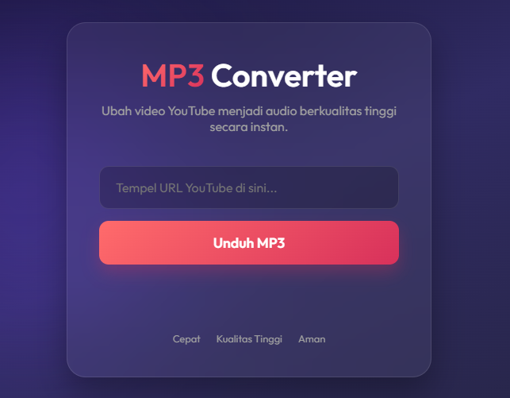

# Premium MP3 Downloader



Aplikasi web sederhana namun elegan untuk mengonversi video YouTube menjadi file MP3 berkualitas tinggi. Dibuat dengan Node.js dan antarmuka "Glassmorphism" yang modern.

## Fitur
- 🎵 **Konversi Cepat**: Mengubah video ke audio secara instan.
- 🎨 **Desain Premium**: Tampilan modern dengan efek kaca dan animasi halus.
- 📱 **Responsif**: Tampilan menyesuaikan dengan perangkat desktop maupun mobile.

## Prasyarat
Sebelum menjalankan aplikasi ini, pastikan Anda telah menginstal [Node.js](https://nodejs.org/) di komputer Anda.

## Cara Menjalankan

1.  **Instal Dependensi**
    Buka terminal di folder proyek ini dan jalankan perintah:
    ```bash
    npm install
    ```

2.  **Jalankan Server**
    Mulai server aplikasi dengan perintah:
    ```bash
    npm start
    ```

3.  **Buka Aplikasi**
    Buka browser dan kunjungi alamat:
    `http://localhost:3000`

## Struktur Proyek
- `server.js`: Backend server menggunakan Express.js.
- `public/`: Folder berisi file frontend (HTML, CSS, JS).

## Catatan
- Aplikasi ini bergantung pada library `ytdl-core`. Jika terjadi error saat mengunduh, kemungkinan ada perubahan pada sistem YouTube dan library perlu diperbarui.
